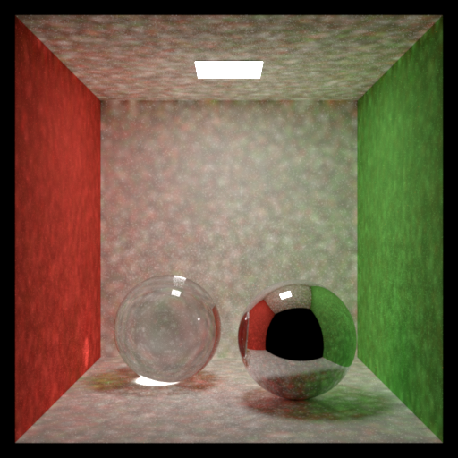
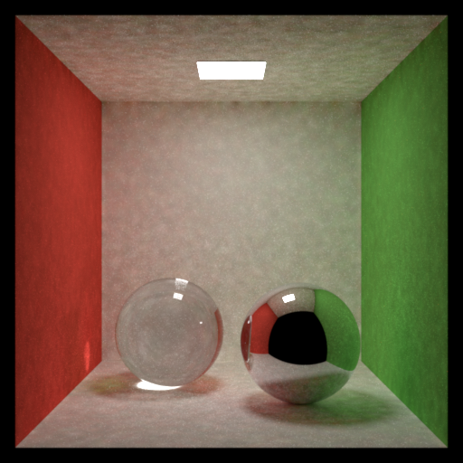
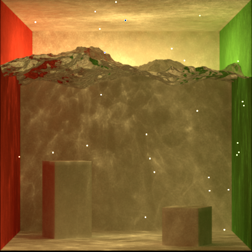

## Mitsuba3 (modified by Jungsik)

1. Photon Map

| Result 1 | Result 2 | Result 3 |
| :---: | :---: | :---: |
|  |  |  |

| Result 1 | Result 2 | Result 3 |
| :---: | :---: | :---: |
|  |  |  |

## About

This project was created by [Wenzel Jakob](https://rgl.epfl.ch/people/wjakob).
Significant features and/or improvements to the code were contributed by
[Sébastien Speierer](https://speierers.github.io/),
[Nicolas Roussel](https://github.com/njroussel),
[Merlin Nimier-David](https://merlin.nimierdavid.fr/),
[Delio Vicini](https://dvicini.github.io/),
[Tizian Zeltner](https://tizianzeltner.com/),
[Baptiste Nicolet](https://bnicolet.com/),
[Miguel Crespo](https://mcrespo.me/),
[Vincent Leroy](https://github.com/leroyvn), and
[Ziyi Zhang](https://github.com/ziyi-zhang).

When using Mitsuba 3 in academic projects, please cite:

```bibtex
@software{Mitsuba3,
    title = {Mitsuba 3 renderer},
    author = {Wenzel Jakob and Sébastien Speierer and Nicolas Roussel and Merlin Nimier-David and Delio Vicini and Tizian Zeltner and Baptiste Nicolet and Miguel Crespo and Vincent Leroy and Ziyi Zhang},
    note = {https://mitsuba-renderer.org},
    version = {3.1.1},
    year = 2022
}
```
